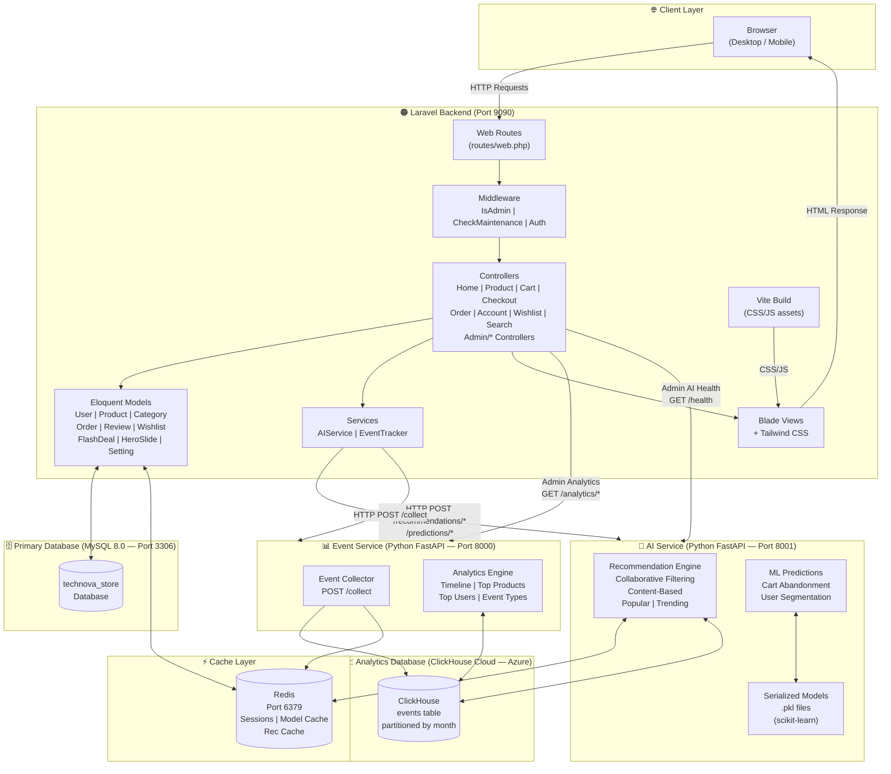
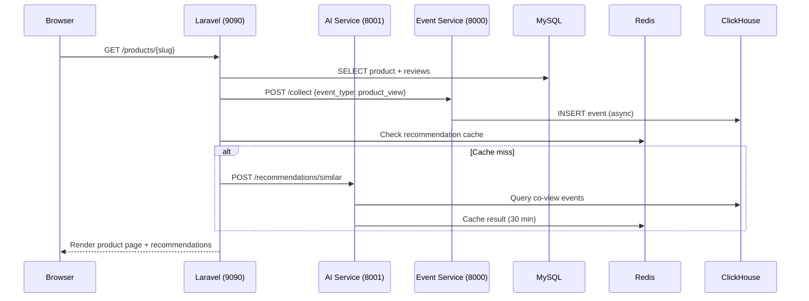

# High-Level Architecture Diagram

> Rendered with [Mermaid](https://mermaid.js.org). Paste into any Mermaid-compatible viewer (GitHub, Notion, mermaid.live).

## System Architecture Overview

---

## Layered Architecture Description

| Layer | Components | Responsibility |
|---|---|---|
| **Presentation** | Blade Views, Tailwind CSS, Vite | Render HTML, handle CSS/JS assets |
| **Routing** | routes/web.php | Map HTTP verbs + URLs to controllers |
| **Middleware** | IsAdmin, CheckMaintenance, Auth | Guard routes, check roles |
| **Controller** | 20+ controllers | Handle HTTP logic, orchestrate services |
| **Service** | AIService, EventTracker | HTTP clients to microservices |
| **Model** | 12 Eloquent models | ORM, relationships, business rules |
| **Database** | MySQL, Redis | Persistent storage, caching |
| **AI Microservice** | FastAPI + scikit-learn | ML models, recommendation algorithms |
| **Event Microservice** | FastAPI + ClickHouse | Behavior event ingestion & analytics |

---

## Communication Patterns

