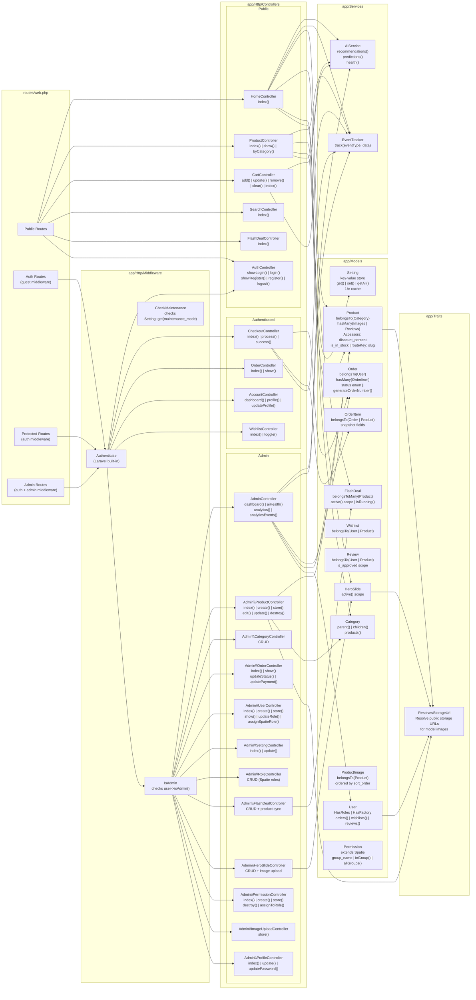
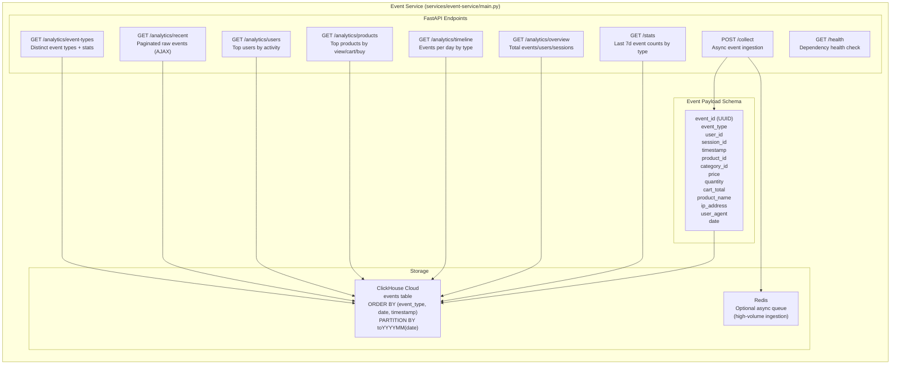
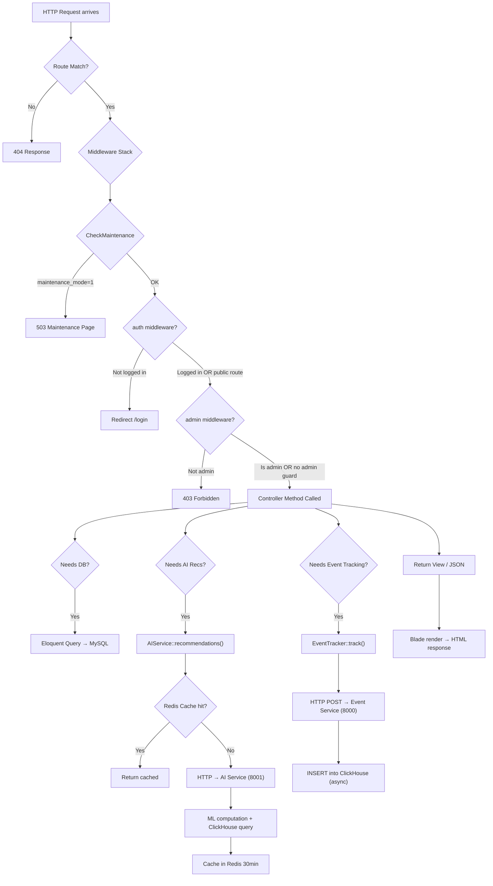

# Low-Level Architecture Diagram

## Laravel Internal Component Map

```mermaid
graph LR
    subgraph ROUTES["routes/web.php"]
        R1["Public Routes"]
        R2["Auth Routes\n(guest middleware)"]
        R3["Protected Routes\n(auth middleware)"]
        R4["Admin Routes\n(auth + admin middleware)"]
    end

    subgraph MIDDLEWARE["app/Http/Middleware"]
        M1["Authenticate\n(Laravel built-in)"]
        M2["IsAdmin\nchecks user->isAdmin()"]
        M3["CheckMaintenance\nchecks Setting::get(maintenance_mode)"]
    end

    subgraph CONTROLLERS["app/Http/Controllers"]
        direction TB
        subgraph PUBLIC_CTRL["Public"]
            C1["HomeController\nindex()"]
            C2["ProductController\nindex() | show() | byCategory()"]
            C3["CartController\nadd() | update() | remove() | clear() | index()"]
            C4["SearchController\nindex()"]
            C5["FlashDealController\nindex()"]
            C6["AuthController\nshowLogin() | login()\nshowRegister() | register() | logout()"]
        end
        subgraph USER_CTRL["Authenticated"]
            C7["CheckoutController\nindex() | process() | success()"]
            C8["OrderController\nindex() | show()"]
            C9["AccountController\ndashboard() | profile() | updateProfile()"]
            C10["WishlistController\nindex() | toggle()"]
        end
        subgraph ADMIN_CTRL["Admin"]
            C11["AdminController\ndashboard() | aiHealth()\nanalytics() | analyticsEvents()"]
            C12["Admin\\ProductController\nindex() | create() | store()\nedit() | update() | destroy()"]
            C13["Admin\\CategoryController\nCRUD"]
            C14["Admin\\OrderController\nindex() | show()\nupdateStatus() | updatePayment()"]
            C15["Admin\\UserController\nindex() | create() | store()\nshow() | updateRole() | assignSpatieRole()"]
            C16["Admin\\SettingController\nindex() | update()"]
            C17["Admin\\RoleController\nCRUD (Spatie roles)"]
            C18["Admin\\FlashDealController\nCRUD + product sync"]
            C19["Admin\\HeroSlideController\nCRUD + image upload"]
            C20["Admin\\PermissionController\nindex() | create() | store()\ndestroy() | assignToRole()"]
            C21["Admin\\ImageUploadController\nstore()"]
            C22["Admin\\ProfileController\nindex() | update() | updatePassword()"]
        end
    end

    subgraph SERVICES["app/Services"]
        S1["AIService\nrecommendations()\npredictions()\nhealth()"]
        S2["EventTracker\ntrack(eventType, data)"]
    end

    subgraph MODELS["app/Models"]
        direction TB
        MOD1["User\nHasRoles | HasFactory\norders() | wishlists() | reviews()"]
        MOD2["Product\nbelongsTo(Category)\nhasMany(Images | Reviews)\nAccessors: discount_percent\nis_in_stock | routeKey: slug"]
        MOD3["Category\nparent() | children()\nproducts()"]
        MOD4["Order\nbelongsTo(User)\nhasMany(OrderItem)\nstatus enum | generateOrderNumber()"]
        MOD5["OrderItem\nbelongsTo(Order | Product)\nsnapshot fields"]
        MOD6["Wishlist\nbelongsTo(User | Product)"]
        MOD7["Review\nbelongsTo(User | Product)\nis_approved scope"]
        MOD8["FlashDeal\nbelongsToMany(Product)\nactive() scope | isRunning()"]
        MOD9["HeroSlide\nactive() scope"]
        MOD10["ProductImage\nbelongsTo(Product)\nordered by sort_order"]
        MOD11["Setting\nkey-value store\nget() | set() | getAll()\n1hr cache"]
        MOD12["Permission\nextends Spatie\ngroup_name | inGroup() | allGroups()"]
    end

    subgraph TRAITS["app/Traits"]
        T1["ResolvesStorageUrl\nResolve public storage URLs\nfor model images"]
    end

    R1 --> C1 & C2 & C3 & C4 & C5 & C6
    R2 --> M1 --> C6
    R3 --> M1 --> C7 & C8 & C9 & C10
    R4 --> M1 --> M2 --> C11 & C12 & C13 & C14 & C15 & C16 & C17 & C18 & C19 & C20 & C21 & C22

    C1 --> S1 & S2 & MOD2 & MOD8 & MOD9 & MOD11
    C2 --> S2 & MOD2 & MOD3 & S1
    C3 --> S1 & S2
    C7 --> MOD4 & MOD5 & S2
    C11 --> S1 & S2 & MOD4 & MOD2 & MOD1
    C12 --> MOD2 & MOD3 & T1
    C19 --> MOD9
    C18 --> MOD8

    MOD2 & MOD1 & MOD9 --> T1
```

---

## AI Service Internal Components

```mermaid
graph TB
    subgraph AI_SERVICE["AI Service (services/ai-service/main.py)"]
        direction TB

        subgraph ENDPOINTS["FastAPI Endpoints"]
            E1["POST /recommendations/collaborative\nUser-based CF from matrix CSV"]
            E2["POST /recommendations/similar\nProduct co-view from ClickHouse"]
            E3["POST /recommendations/popular\nTop products by purchase count"]
            E4["POST /recommendations/trending\nGrowth-based trending score"]
            E5["POST /predictions/cart-abandonment\nRF classifier — abandonment risk"]
            E6["POST /analytics/user-segment\nK-means segment prediction"]
            E7["GET /analytics/model-performance\nModel accuracy & metadata"]
            E8["POST /train\nBackground retrain on live data"]
            E9["GET /health\nDependency health check"]
            E10["GET /users/{id}/profile\nFull AI user profile"]
        end

        subgraph ML_MODELS["ML Models (models/*.pkl)"]
            M1["cart_abandonment_model.pkl\nRandomForestClassifier"]
            M2["cart_abandonment_scaler.pkl\nStandardScaler"]
            M3["user_segmentation_model.pkl\nKMeans (5 clusters)"]
            M4["user_segmentation_scaler.pkl\nStandardScaler"]
            M5["segment_names.pkl\nCluster → Label mapping"]
        end

        subgraph DATA["Data Sources"]
            D1["data/popular_products.csv"]
            D2["data/user_product_matrix.csv\n(user × product interactions)"]
            D3["data/user_segments.csv\n(precomputed segments)"]
        end

        subgraph DEPS["External Dependencies"]
            DEP1["ClickHouse Cloud\n(events table)"]
            DEP2["Redis\nrec cache 30min–1hr"]
        end

        TRAIN["train.py\nRetrain models from ClickHouse"]
    end

    E1 --> D2 & DEP2
    E2 --> DEP1 & DEP2
    E3 --> DEP1 & DEP2
    E4 --> DEP1 & DEP2
    E5 --> M1 & M2
    E6 --> M3 & M4 & M5
    E7 --> M1 & M3
    E8 --> TRAIN
    TRAIN --> M1 & M2 & M3 & M4 & M5
    TRAIN --> DEP1
```

---

## Event Service Internal Components

```mermaid
graph TB
    subgraph EVENT_SERVICE["Event Service (services/event-service/main.py)"]
        direction TB

        subgraph ENDPOINTS["FastAPI Endpoints"]
            EV1["POST /collect\nAsync event ingestion"]
            EV2["GET /stats\nLast 7d event counts by type"]
            EV3["GET /health\nDependency health check"]
            EV4["GET /analytics/overview\nTotal events/users/sessions"]
            EV5["GET /analytics/timeline\nEvents per day by type"]
            EV6["GET /analytics/products\nTop products by view/cart/buy"]
            EV7["GET /analytics/users\nTop users by activity"]
            EV8["GET /analytics/recent\nPaginated raw events (AJAX)"]
            EV9["GET /analytics/event-types\nDistinct event types + stats"]
        end

        subgraph EVENT_SCHEMA["Event Payload Schema"]
            SCH["event_id (UUID)\nevent_type\nuser_id\nsession_id\ntimestamp\nproduct_id\ncategory_id\nprice\nquantity\ncart_total\nproduct_name\nip_address\nuser_agent\ndate"]
        end

        subgraph STORAGE["Storage"]
            ST1["ClickHouse Cloud\nevents table\nORDER BY (event_type, date, timestamp)\nPARTITION BY toYYYYMM(date)"]
            ST2["Redis\nOptional async queue\n(high-volume ingestion)"]
        end
    end

    EV1 --> SCH --> ST1
    EV1 --> ST2
    EV2 & EV4 & EV5 & EV6 & EV7 & EV8 & EV9 --> ST1
```

---

## Request Lifecycle (Detailed)

```mermaid
flowchart TD
    A["HTTP Request arrives"] --> B{"Route Match?"}
    B -- No --> Z["404 Response"]
    B -- Yes --> C{"Middleware Stack"}
    C --> D{"CheckMaintenance"}
    D -- "maintenance_mode=1" --> ZZ["503 Maintenance Page"]
    D -- "OK" --> E{"auth middleware?"}
    E -- "Not logged in" --> F["Redirect /login"]
    E -- "Logged in OR public route" --> G{"admin middleware?"}
    G -- "Not admin" --> H["403 Forbidden"]
    G -- "Is admin OR no admin guard" --> I["Controller Method Called"]
    I --> J{"Needs DB?"}
    J -- Yes --> K["Eloquent Query → MySQL"]
    I --> L{"Needs AI Recs?"}
    L -- Yes --> M["AIService::recommendations()"]
    M --> N{"Redis Cache hit?"}
    N -- Yes --> O["Return cached"]
    N -- No --> P["HTTP → AI Service (8001)"]
    P --> Q["ML computation + ClickHouse query"]
    Q --> R["Cache in Redis 30min"]
    I --> S{"Needs Event Tracking?"}
    S -- Yes --> T["EventTracker::track()"]
    T --> U["HTTP POST → Event Service (8000)"]
    U --> V["INSERT into ClickHouse (async)"]
    I --> W["Return View / JSON"]
    W --> X["Blade render → HTML response"]
```
