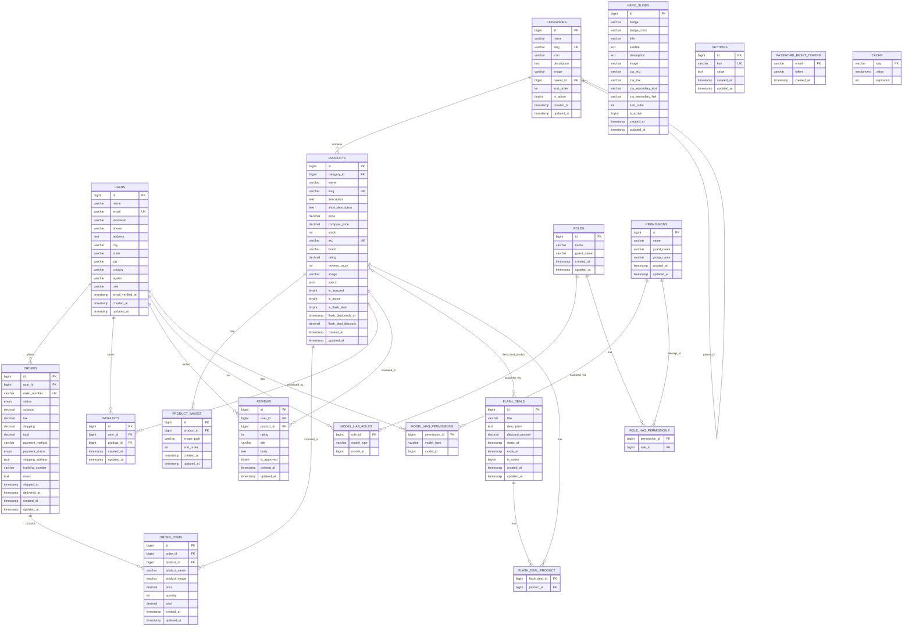
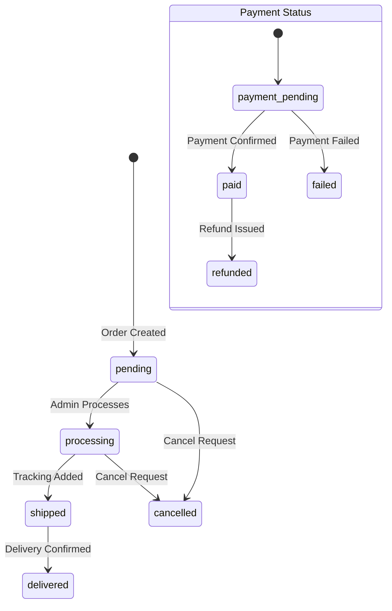

# Database ER Diagram

## Entity-Relationship Diagram (MySQL — technova_store)

---

## Table Descriptions

### Core Tables

| Table | Purpose | Key Columns |
|---|---|---|
| `users` | Customer & admin accounts | `role` (admin/user), `avatar`, address fields |
| `categories` | Product taxonomy (hierarchical) | `parent_id` → self-join, `slug` |
| `products` | Product catalog | `slug` (route key), `specs` (JSON), `is_flash_deal`, `rating` |
| `product_images` | Multiple images per product | `sort_order` for ordering |
| `orders` | Purchase records | `status` enum, `shipping_address` JSON, `order_number` |
| `order_items` | Snapshot of products at purchase | Denormalized `product_name`, `price` |
| `wishlists` | Saved products | Junction: user ↔ product |
| `reviews` | Product ratings & text | `is_approved` moderation flag |

### Marketing Tables

| Table | Purpose |
|---|---|
| `flash_deals` | Time-limited promotion metadata |
| `flash_deal_product` | M:N junction: flash deal ↔ products |
| `hero_slides` | Homepage carousel slides |
| `settings` | Key-value site configuration |

### RBAC Tables (Spatie)

| Table | Purpose |
|---|---|
| `roles` | Named roles (admin, user, etc.) |
| `permissions` | Named permissions with `group_name` |
| `model_has_roles` | Polymorphic: model → role assignment |
| `model_has_permissions` | Polymorphic: model → permission assignment |
| `role_has_permissions` | Junction: role ↔ permissions |

### System Tables

| Table | Purpose |
|---|---|
| `cache` | Laravel file/database cache storage |
| `password_reset_tokens` | Email-based password reset flow |

---

## Order Status State Machine

