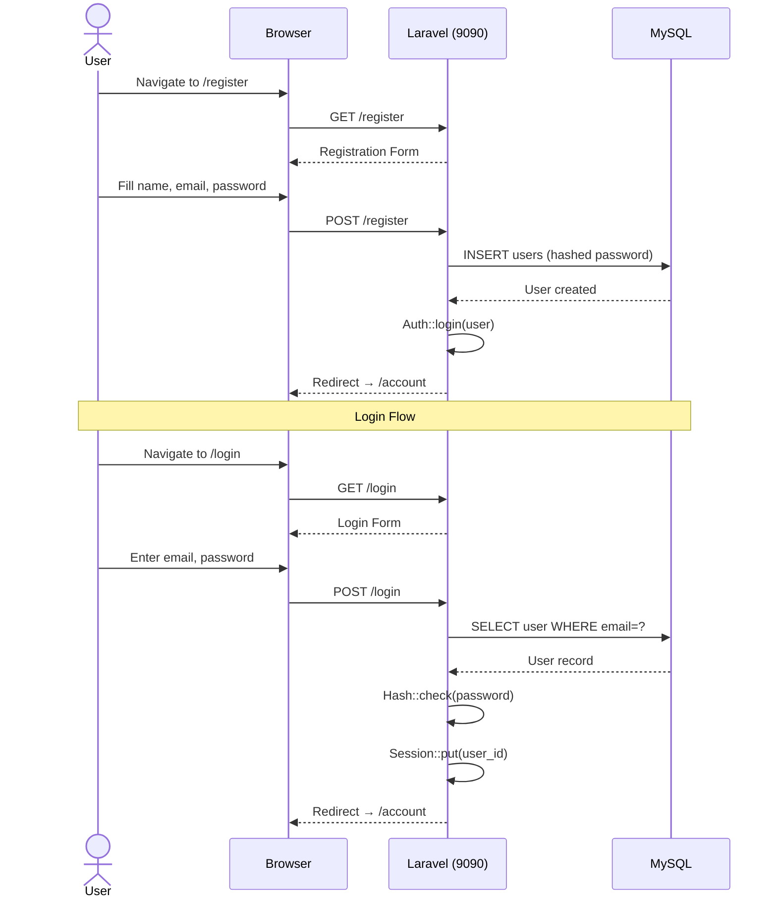
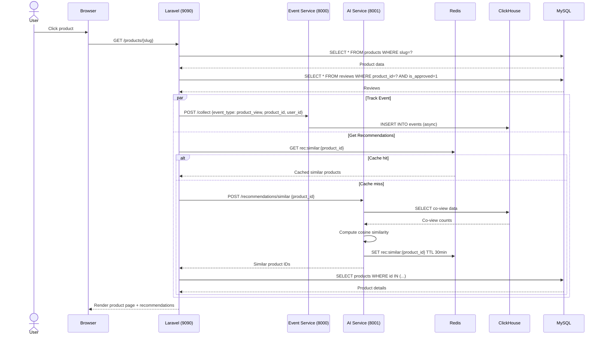
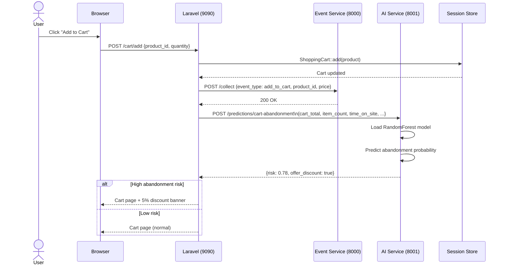
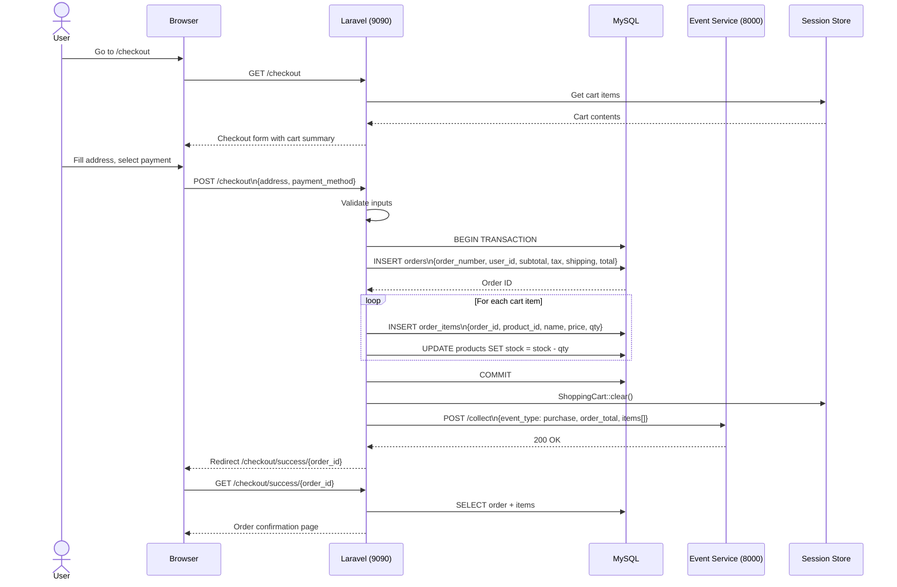
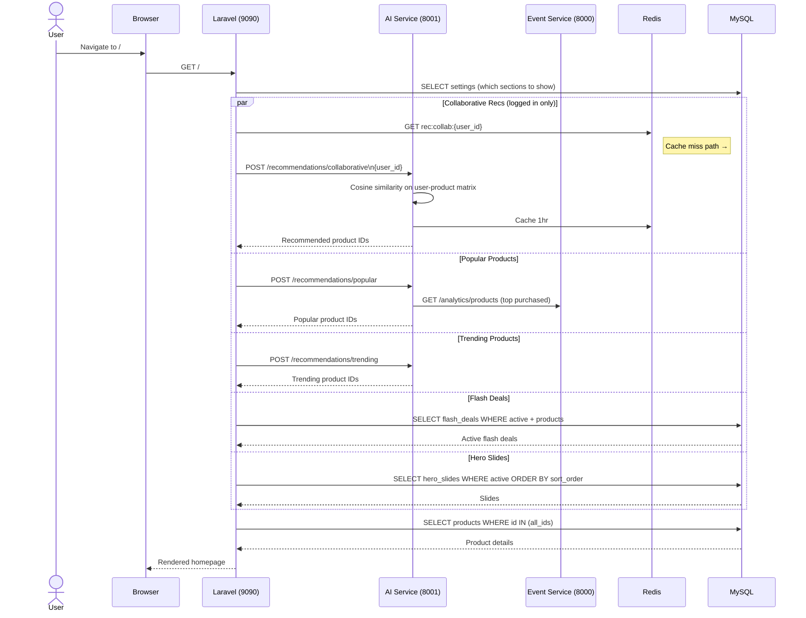
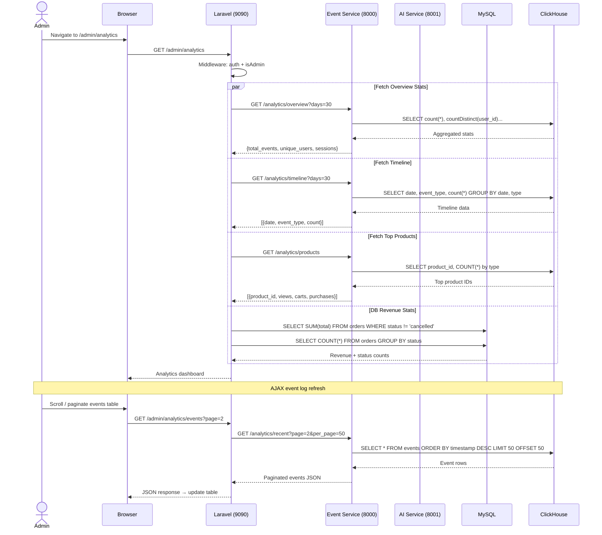
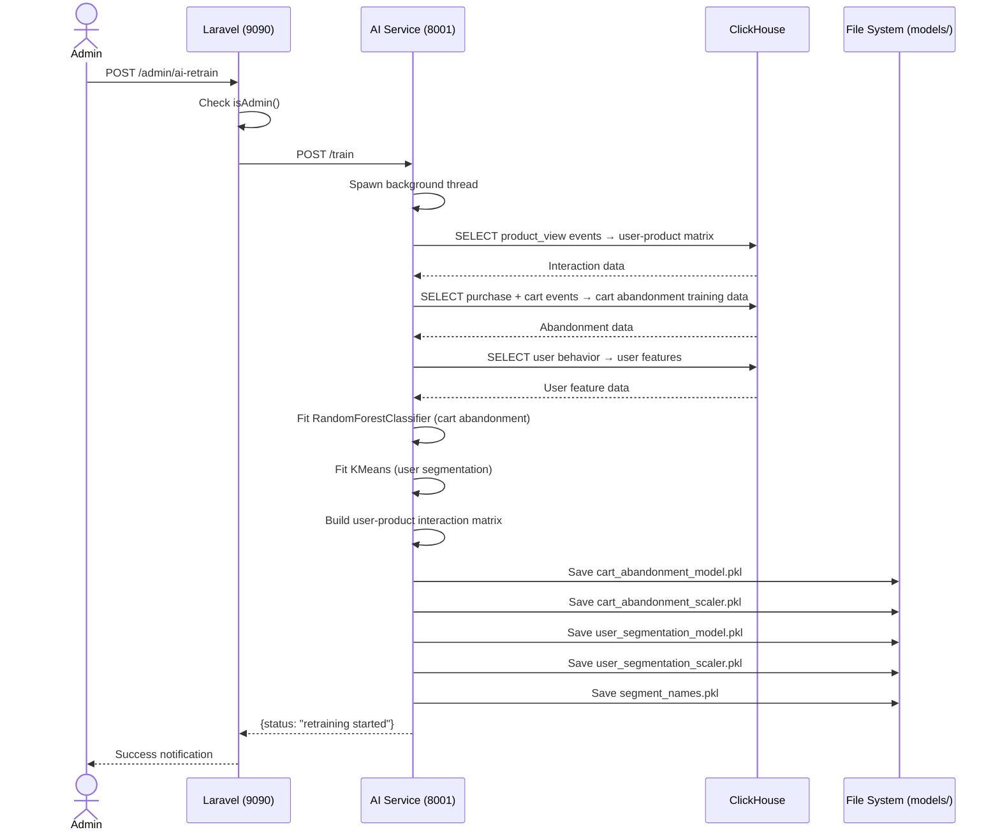

# Sequence Diagrams

## 1. User Registration & Login Flow

---

## 2. Product Browse & Recommendation Flow

---

## 3. Add to Cart & Cart Abandonment Prediction

---

## 4. Checkout & Order Creation Flow

---

## 5. Homepage Personalization Flow

---

## 6. Admin Analytics Flow

---

## 7. AI Model Retraining Flow

