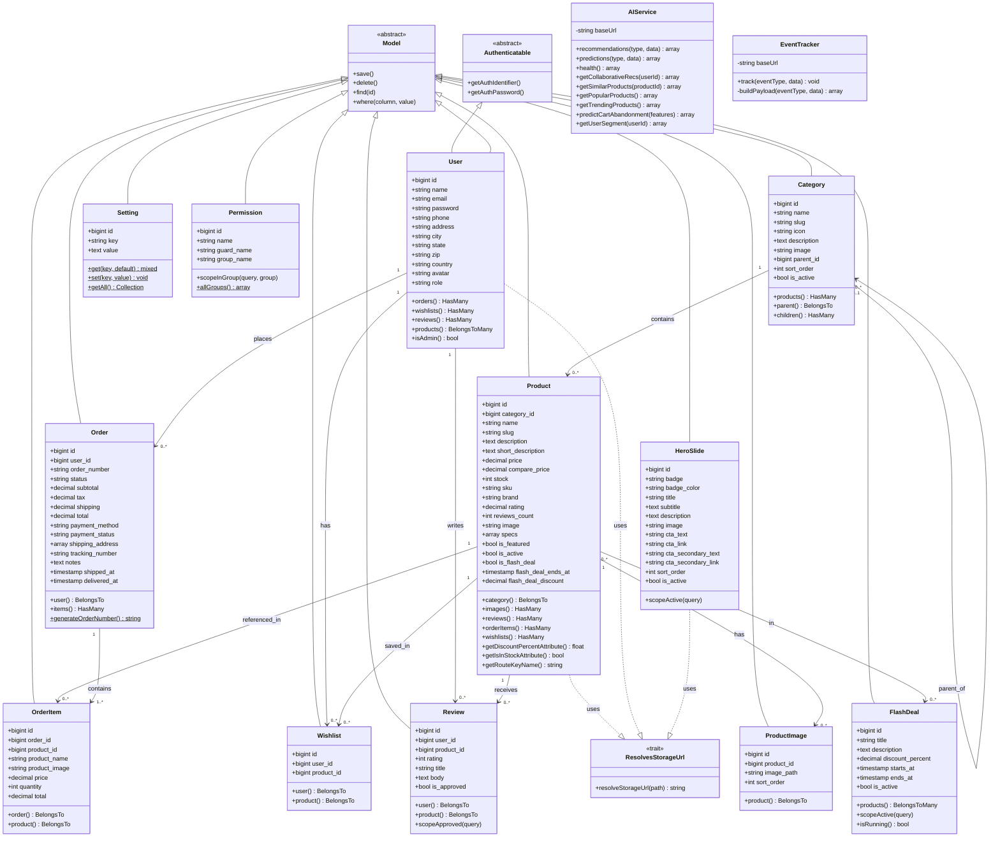
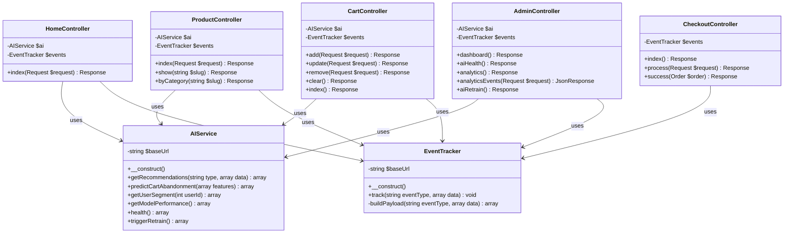

# Class Diagram

## Laravel Models Class Diagram

```mermaid
classDiagram
    class Model {
        <<abstract>>
        +save()
        +delete()
        +find(id)
        +where(column, value)
    }

    class Authenticatable {
        <<abstract>>
        +getAuthIdentifier()
        +getAuthPassword()
    }

    class User {
        +bigint id
        +string name
        +string email
        +string password
        +string phone
        +string address
        +string city
        +string state
        +string zip
        +string country
        +string avatar
        +string role
        +orders() HasMany
        +wishlists() HasMany
        +reviews() HasMany
        +products() BelongsToMany
        +isAdmin() bool
    }

    class Product {
        +bigint id
        +bigint category_id
        +string name
        +string slug
        +text description
        +text short_description
        +decimal price
        +decimal compare_price
        +int stock
        +string sku
        +string brand
        +decimal rating
        +int reviews_count
        +string image
        +array specs
        +bool is_featured
        +bool is_active
        +bool is_flash_deal
        +timestamp flash_deal_ends_at
        +decimal flash_deal_discount
        +category() BelongsTo
        +images() HasMany
        +reviews() HasMany
        +orderItems() HasMany
        +wishlists() HasMany
        +getDiscountPercentAttribute() float
        +getIsInStockAttribute() bool
        +getRouteKeyName() string
    }

    class Category {
        +bigint id
        +string name
        +string slug
        +string icon
        +text description
        +string image
        +bigint parent_id
        +int sort_order
        +bool is_active
        +products() HasMany
        +parent() BelongsTo
        +children() HasMany
    }

    class Order {
        +bigint id
        +bigint user_id
        +string order_number
        +string status
        +decimal subtotal
        +decimal tax
        +decimal shipping
        +decimal total
        +string payment_method
        +string payment_status
        +array shipping_address
        +string tracking_number
        +text notes
        +timestamp shipped_at
        +timestamp delivered_at
        +user() BelongsTo
        +items() HasMany
        +generateOrderNumber()$ string
    }

    class OrderItem {
        +bigint id
        +bigint order_id
        +bigint product_id
        +string product_name
        +string product_image
        +decimal price
        +int quantity
        +decimal total
        +order() BelongsTo
        +product() BelongsTo
    }

    class Wishlist {
        +bigint id
        +bigint user_id
        +bigint product_id
        +user() BelongsTo
        +product() BelongsTo
    }

    class Review {
        +bigint id
        +bigint user_id
        +bigint product_id
        +int rating
        +string title
        +text body
        +bool is_approved
        +user() BelongsTo
        +product() BelongsTo
        +scopeApproved(query)
    }

    class FlashDeal {
        +bigint id
        +string title
        +text description
        +decimal discount_percent
        +timestamp starts_at
        +timestamp ends_at
        +bool is_active
        +products() BelongsToMany
        +scopeActive(query)
        +isRunning() bool
    }

    class HeroSlide {
        +bigint id
        +string badge
        +string badge_color
        +string title
        +text subtitle
        +text description
        +string image
        +string cta_text
        +string cta_link
        +string cta_secondary_text
        +string cta_secondary_link
        +int sort_order
        +bool is_active
        +scopeActive(query)
    }

    class ProductImage {
        +bigint id
        +bigint product_id
        +string image_path
        +int sort_order
        +product() BelongsTo
    }

    class Setting {
        +bigint id
        +string key
        +text value
        +get(key, default)$ mixed
        +set(key, value)$ void
        +getAll()$ Collection
    }

    class Permission {
        +bigint id
        +string name
        +string guard_name
        +string group_name
        +scopeInGroup(query, group)
        +allGroups()$ array
    }

    class AIService {
        -string baseUrl
        +recommendations(type, data) array
        +predictions(type, data) array
        +health() array
        +getCollaborativeRecs(userId) array
        +getSimilarProducts(productId) array
        +getPopularProducts() array
        +getTrendingProducts() array
        +predictCartAbandonment(features) array
        +getUserSegment(userId) array
    }

    class EventTracker {
        -string baseUrl
        +track(eventType, data) void
        -buildPayload(eventType, data) array
    }

    class ResolvesStorageUrl {
        <<trait>>
        +resolveStorageUrl(path) string
    }

    Authenticatable <|-- User
    Model <|-- User
    Model <|-- Product
    Model <|-- Category
    Model <|-- Order
    Model <|-- OrderItem
    Model <|-- Wishlist
    Model <|-- Review
    Model <|-- FlashDeal
    Model <|-- HeroSlide
    Model <|-- ProductImage
    Model <|-- Setting
    Model <|-- Permission

    User "1" --> "0..*" Order : places
    User "1" --> "0..*" Wishlist : has
    User "1" --> "0..*" Review : writes

    Category "1" --> "0..*" Product : contains
    Category "0..1" --> "0..*" Category : parent_of

    Product "1" --> "0..*" ProductImage : has
    Product "1" --> "0..*" OrderItem : referenced_in
    Product "1" --> "0..*" Review : receives
    Product "1" --> "0..*" Wishlist : saved_in
    Product "0..*" --> "0..*" FlashDeal : in

    Order "1" --> "1..*" OrderItem : contains

    Product ..|> ResolvesStorageUrl : uses
    User ..|> ResolvesStorageUrl : uses
    HeroSlide ..|> ResolvesStorageUrl : uses
```

---

## Service Layer Class Diagram

```mermaid
classDiagram
    class AIService {
        -string $baseUrl
        +__construct()
        +getRecommendations(string type, array data) array
        +predictCartAbandonment(array features) array
        +getUserSegment(int userId) array
        +getModelPerformance() array
        +health() array
        +triggerRetrain() array
    }

    class EventTracker {
        -string $baseUrl
        +__construct()
        +track(string eventType, array data) void
        -buildPayload(string eventType, array data) array
    }

    class HomeController {
        -AIService $ai
        -EventTracker $events
        +index(Request $request) Response
    }

    class ProductController {
        -AIService $ai
        -EventTracker $events
        +index(Request $request) Response
        +show(string $slug) Response
        +byCategory(string $slug) Response
    }

    class CartController {
        -AIService $ai
        -EventTracker $events
        +add(Request $request) Response
        +update(Request $request) Response
        +remove(Request $request) Response
        +clear() Response
        +index() Response
    }

    class CheckoutController {
        -EventTracker $events
        +index() Response
        +process(Request $request) Response
        +success(Order $order) Response
    }

    class AdminController {
        -AIService $ai
        -EventTracker $events
        +dashboard() Response
        +aiHealth() Response
        +analytics() Response
        +analyticsEvents(Request $request) JsonResponse
        +aiRetrain() Response
    }

    HomeController --> AIService : uses
    HomeController --> EventTracker : uses
    ProductController --> AIService : uses
    ProductController --> EventTracker : uses
    CartController --> AIService : uses
    CartController --> EventTracker : uses
    CheckoutController --> EventTracker : uses
    AdminController --> AIService : uses
    AdminController --> EventTracker : uses
```
