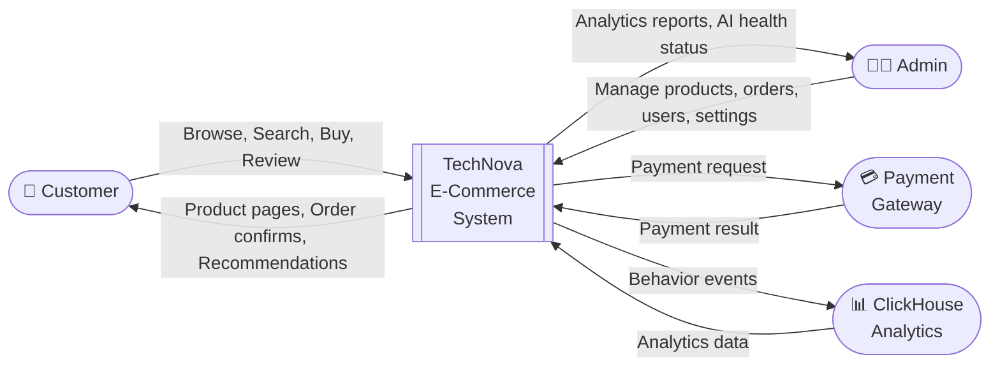
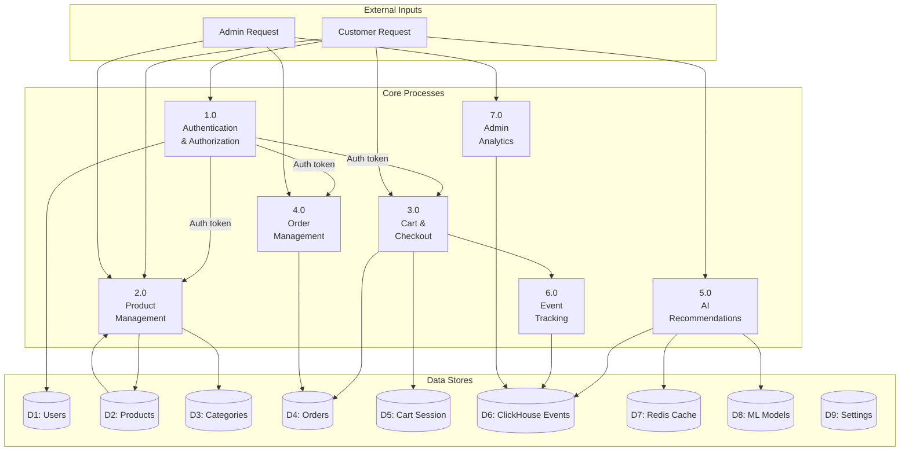
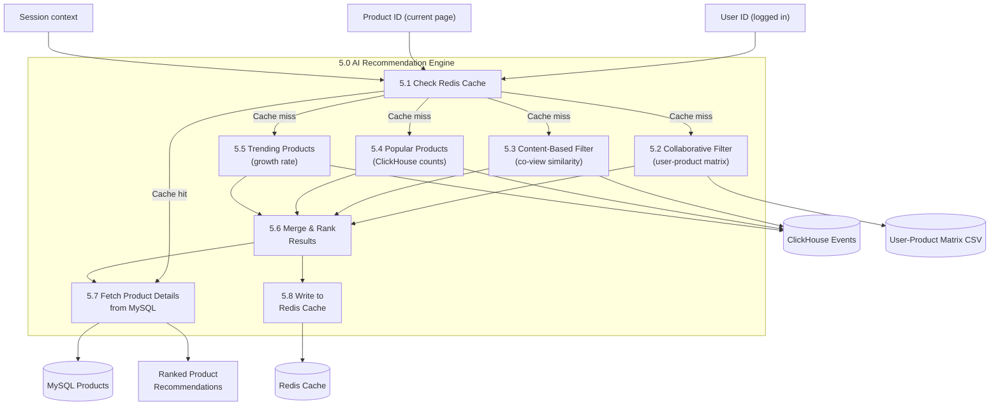
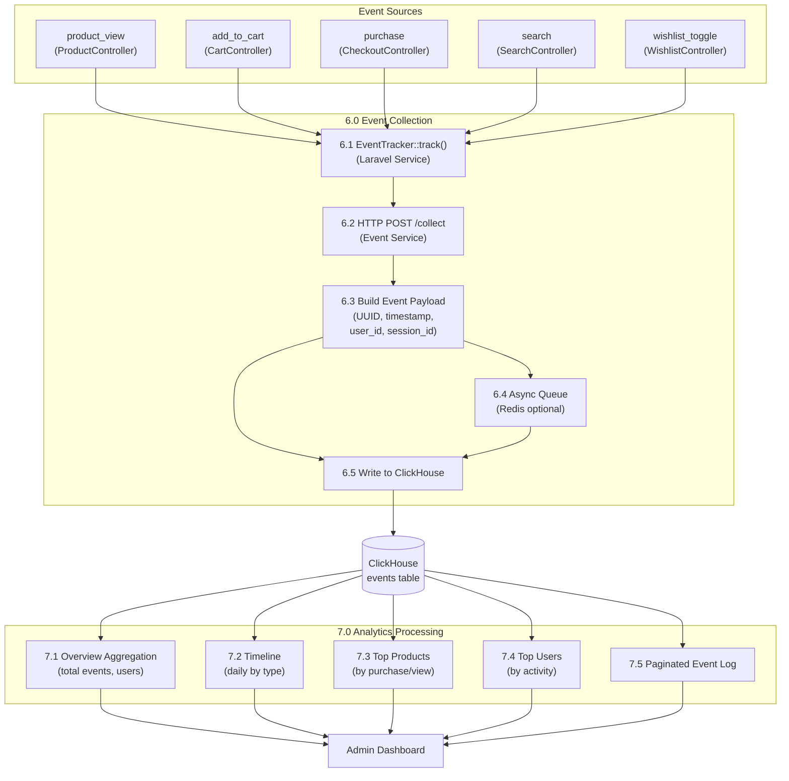
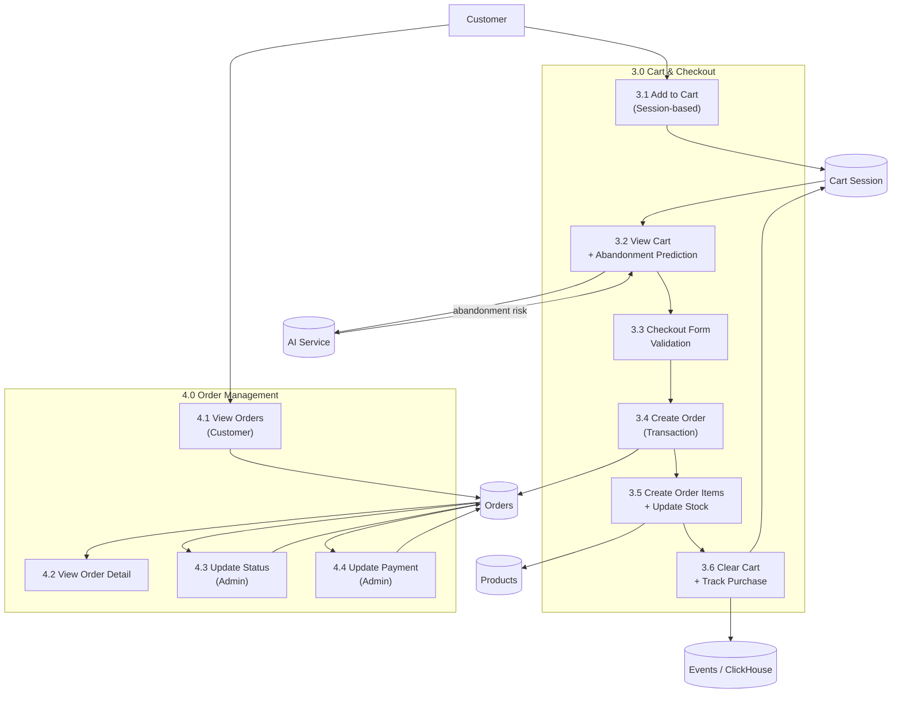

# Data Flow Diagrams

## Level 0 — Context Diagram (System Overview)

---

## Level 1 — Major Process Decomposition

---

## Level 2 — AI Recommendation Process (Process 5.0)

---

## Level 2 — Event Tracking & Analytics (Process 6.0 & 7.0)

---

## Level 2 — Order Processing (Process 3.0 & 4.0)

