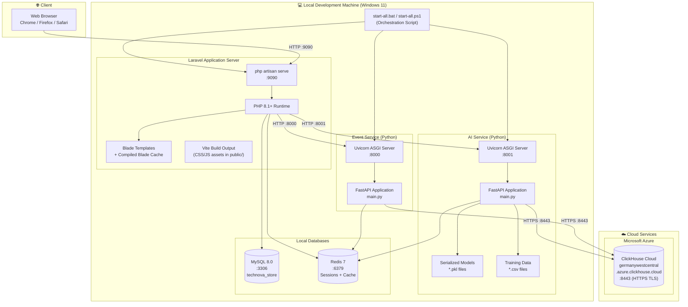
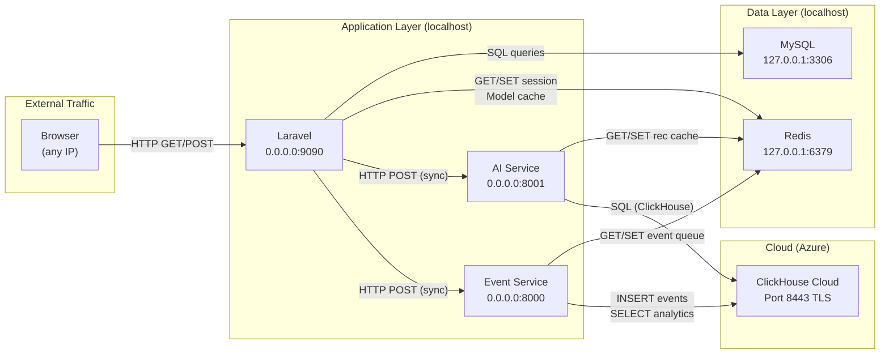
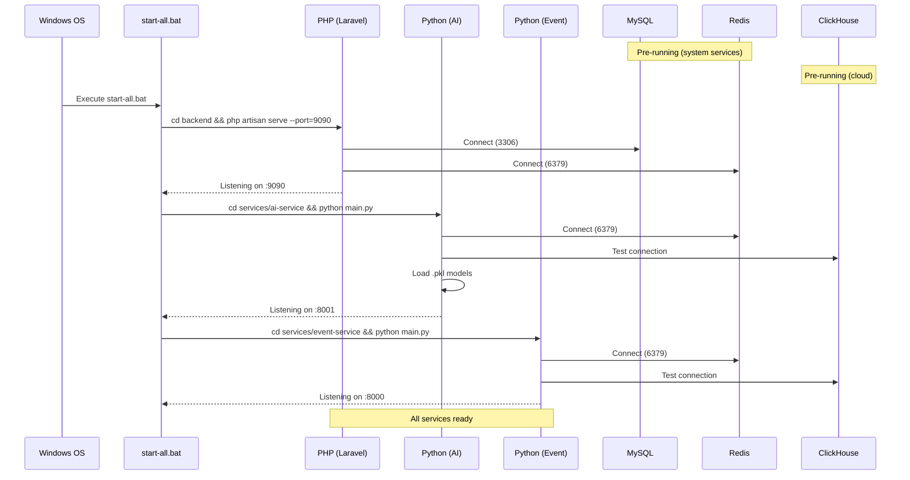

# Deployment Diagram

## Infrastructure Deployment Overview

---

## Network Communication Map

---

## Component Version Matrix

| Component | Version | Runtime |
|---|---|---|
| PHP | 8.1+ | php-cgi / cli |
| Laravel | 11.x | PHP framework |
| MySQL | 8.0 | mysqld |
| Redis | 7.x | redis-server |
| Python | 3.11 | CPython |
| FastAPI | 0.115+ | uvicorn |
| scikit-learn | 1.3+ | pip |
| pandas | 2.x | pip |
| ClickHouse Driver | clickhouse-connect | pip |
| Node.js | 18+ | npm (build only) |
| Vite | 6.0 | npm dev/build |
| Tailwind CSS | 3.4 | npm |

---

## Startup Sequence

