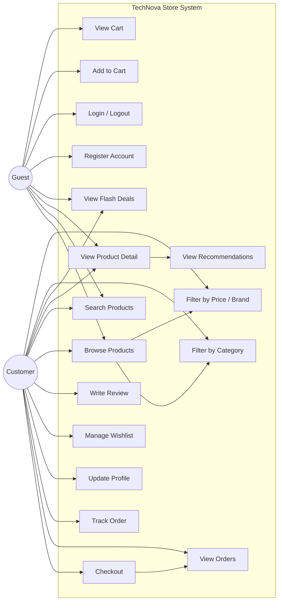
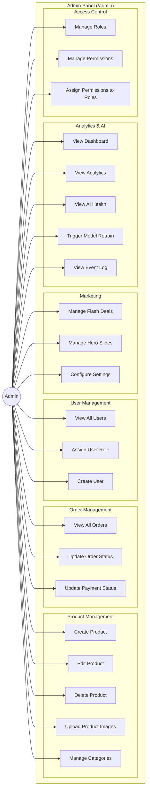
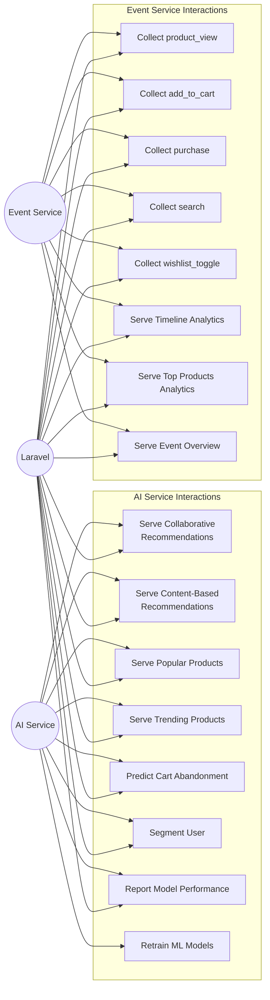

# Use Case Diagrams

## System Actors

| Actor | Description |
|---|---|
| **Guest** | Unauthenticated visitor |
| **Customer** | Registered, logged-in user |
| **Admin** | User with `role = admin` or Spatie admin role |
| **AI Service** | ML microservice (automated actor) |
| **Event Service** | Analytics microservice (automated actor) |

---

## Customer Use Cases

---

## Admin Use Cases

---

## Automated Actor Use Cases

---

## Full System Use Case Table

| Use Case | Actor | Route | Method |
|---|---|---|---|
| Browse Products | Guest/Customer | /products | GET |
| Search Products | Guest/Customer | /search | GET |
| View Product | Guest/Customer | /products/{slug} | GET |
| View Flash Deals | Guest/Customer | /flash-deals | GET |
| Add to Cart | Guest/Customer | /cart/add | POST |
| View Cart | Guest/Customer | /cart | GET |
| Update Cart | Guest/Customer | /cart/update | POST |
| Remove from Cart | Guest/Customer | /cart/remove | POST |
| Register | Guest | /register | POST |
| Login | Guest | /login | POST |
| Logout | Customer | /logout | POST |
| Checkout | Customer | /checkout | GET/POST |
| View Orders | Customer | /orders | GET |
| View Order Detail | Customer | /orders/{id} | GET |
| Update Profile | Customer | /account/profile | POST |
| Toggle Wishlist | Customer | /wishlist/toggle | POST |
| Admin Dashboard | Admin | /admin | GET |
| Manage Products | Admin | /admin/products | CRUD |
| Manage Categories | Admin | /admin/categories | CRUD |
| Manage Orders | Admin | /admin/orders | GET/PATCH |
| Manage Users | Admin | /admin/users | GET/POST/PATCH |
| View Analytics | Admin | /admin/analytics | GET |
| AI Health Check | Admin | /admin/ai-health | GET |
| Retrain AI | Admin | /admin/ai-retrain | POST |
| Manage Flash Deals | Admin | /admin/flash-deals | CRUD |
| Manage Hero Slides | Admin | /admin/slides | CRUD |
| Manage Settings | Admin | /admin/settings | GET/POST |
| Manage Roles | Admin | /admin/roles | CRUD |
| Manage Permissions | Admin | /admin/permissions | CRUD |
