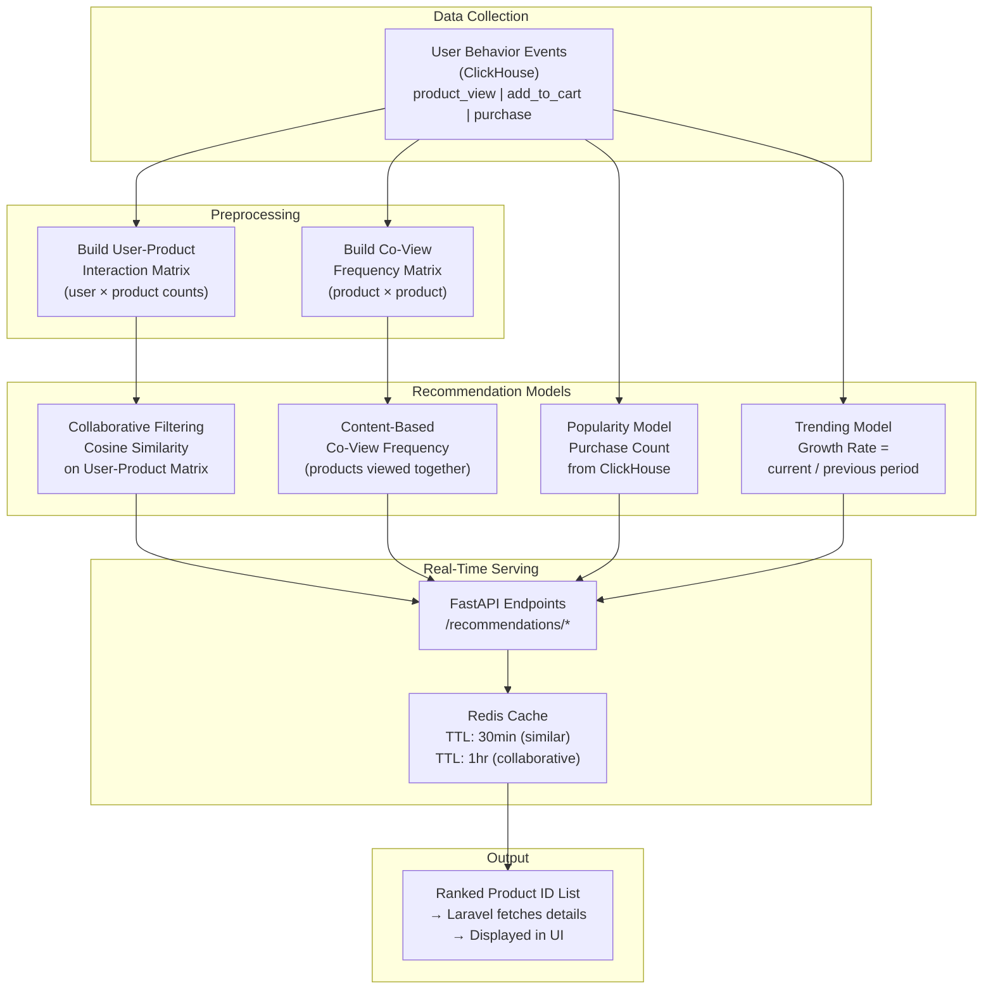
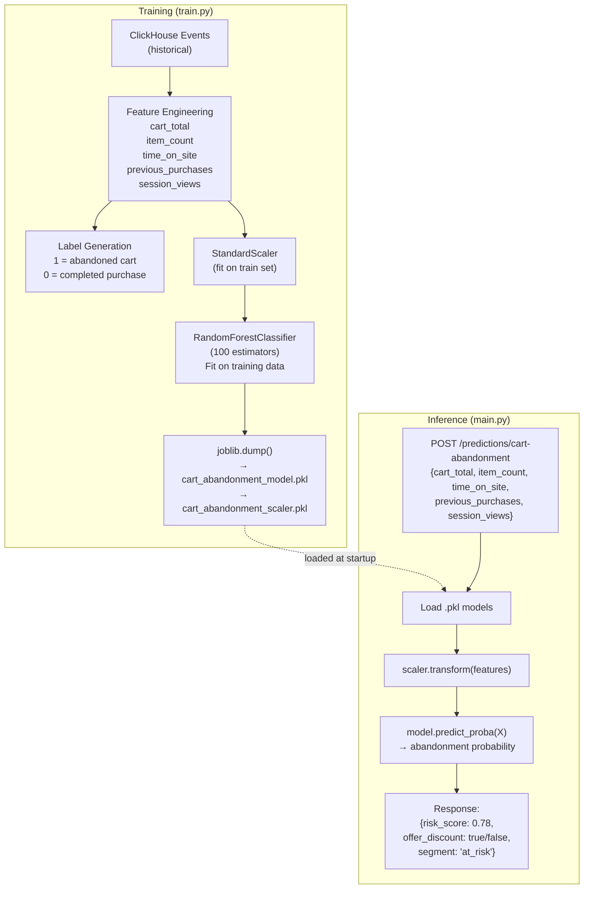
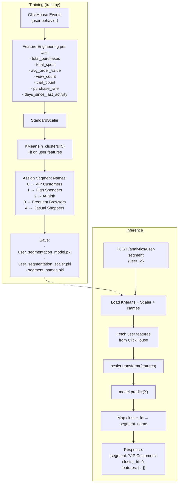
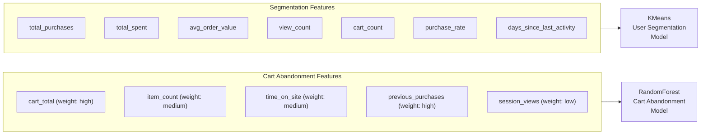
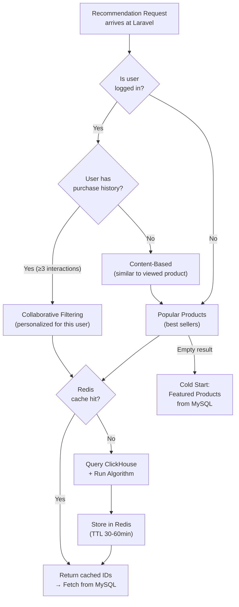

# ML / AI Pipeline Documentation

## Overview

The AI layer consists of two main ML pipelines:
1. **Recommendation Engine** — real-time product recommendations
2. **Predictive Analytics** — cart abandonment risk & user segmentation

---

## Recommendation Pipeline

---

## Cart Abandonment Prediction Pipeline

---

## User Segmentation Pipeline

---

## User Segmentation Definitions

| Segment | Behavior Profile | Marketing Action |
|---|---|---|
| **VIP Customers** | High spend, frequent purchases, recent activity | Loyalty rewards, early access |
| **High Spenders** | High order values, moderate frequency | Upsell premium products |
| **At Risk** | Previously active, now dormant | Win-back campaigns, discounts |
| **Frequent Browsers** | High view count, low purchases | Conversion nudges, discounts |
| **Casual Shoppers** | Low activity across all metrics | Awareness campaigns |

---

## AI Feature Importance & Model Metrics

---

## Recommendation Algorithm Decision Logic

