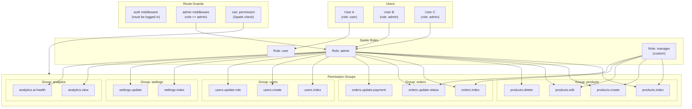
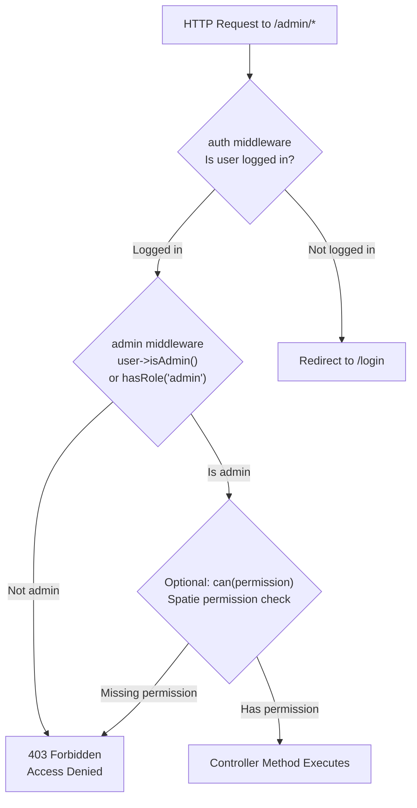
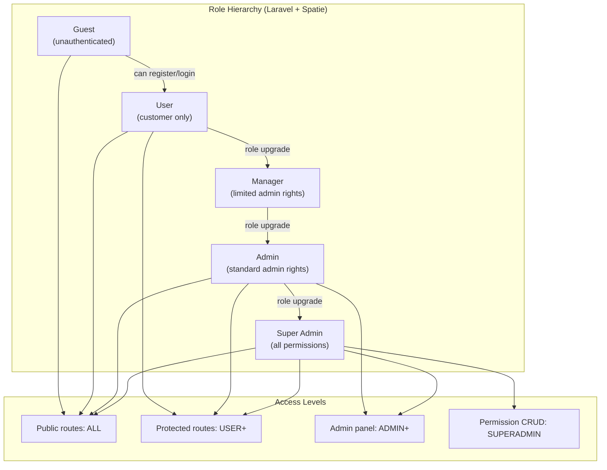

# Role-Based Access Control (RBAC) Diagram

## RBAC Architecture

---

## Authorization Flow

---

## User Role Hierarchy

---

## Permission Group Mapping

| Group | Permissions | Assigned to Role |
|---|---|---|
| `products` | index, create, edit, delete | admin, manager |
| `orders` | index, update-status, update-payment | admin, manager |
| `users` | index, create, update-role | admin |
| `settings` | index, update | admin |
| `analytics` | view, ai-health | admin |
| `flash-deals` | index, create, edit, delete | admin, manager |
| `slides` | index, create, edit, delete | admin |
| `roles` | index, create, edit, delete | admin |
| `permissions` | index, create, destroy, assign | admin (super) |
