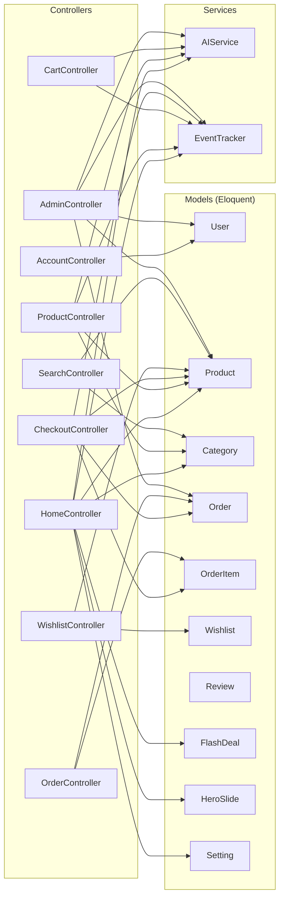
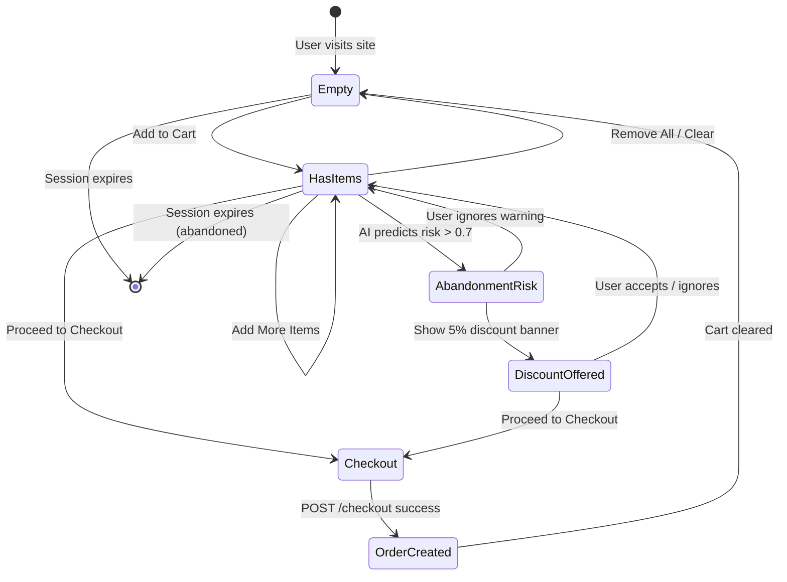

# Component Interaction Diagrams

## Frontend Component Map (Blade Views)

```mermaid
graph TD
    subgraph LAYOUTS["Layouts"]
        LAY1["layouts/app.blade.php\n(Customer layout)"]
        LAY2["layouts/admin.blade.php\n(Admin layout)"]
    end

    subgraph COMPONENTS["Shared Components"]
        COM1["components/navbar.blade.php\nCart count | User menu | Search bar"]
        COM2["components/footer.blade.php"]
        COM3["components/product-card.blade.php\nImage | Price | Rating | Add to Cart"]
        COM4["components/flash-message.blade.php\nSuccess / Error alerts"]
        COM5["components/hero-slider.blade.php\nAdmin-managed carousel"]
    end

    subgraph PUBLIC_VIEWS["Public Pages"]
        V1["home.blade.php\nHero slider + Recs + Flash deals"]
        V2["products/index.blade.php\nFilter sidebar + Grid"]
        V3["products/show.blade.php\nImages | Specs | Reviews + Similar"]
        V4["cart/index.blade.php\nItems | Totals | Abandonment offer"]
        V5["checkout/index.blade.php\nAddress form | Order summary"]
        V6["checkout/success.blade.php\nOrder confirmation"]
        V7["search/index.blade.php\nSearch results + filters"]
        V8["flash-deals/index.blade.php\nDeals grid + countdown"]
    end

    subgraph AUTH_VIEWS["Auth Pages"]
        A1["auth/login.blade.php"]
        A2["auth/register.blade.php"]
    end

    subgraph USER_VIEWS["Account Pages"]
        U1["account/dashboard.blade.php"]
        U2["account/profile.blade.php"]
        U3["orders/index.blade.php"]
        U4["orders/show.blade.php"]
        U5["wishlist/index.blade.php"]
    end

    subgraph ADMIN_VIEWS["Admin Pages"]
        AD1["admin/dashboard.blade.php\nKPIs + Charts + Top products"]
        AD2["admin/products/*.blade.php\nCRUD forms"]
        AD3["admin/orders/*.blade.php\nOrder list + detail + status"]
        AD4["admin/users/*.blade.php\nUser list + role mgmt"]
        AD5["admin/analytics/*.blade.php\nClickHouse charts"]
        AD6["admin/settings/*.blade.php"]
        AD7["admin/roles/*.blade.php"]
        AD8["admin/flash-deals/*.blade.php"]
        AD9["admin/slides/*.blade.php"]
        AD10["admin/permissions/*.blade.php"]
        AD11["admin/ai-health.blade.php\nService health + model metrics"]
    end

    LAY1 --> COM1 & COM2 & COM4
    LAY2 --> COM4

    LAY1 --> V1 & V2 & V3 & V4 & V5 & V6 & V7 & V8
    LAY1 --> A1 & A2
    LAY1 --> U1 & U2 & U3 & U4 & U5

    LAY2 --> AD1 & AD2 & AD3 & AD4 & AD5 & AD6 & AD7 & AD8 & AD9 & AD10 & AD11

    V1 --> COM5 & COM3
    V2 --> COM3
    V3 --> COM3
```



---

## Backend Controller-Model-Service Interaction



---

## State Diagram — Cart Lifecycle



---

## Event Flow State Diagram

```mermaid
stateDiagram-v2
    [*] --> EventCreated : User action triggers EventTracker::track()

    EventCreated --> Serialized : Build payload (UUID, timestamps, user context)

    Serialized --> HTTPPost : POST to Event Service (:8000/collect)

    state HTTPPost {
        [*] --> Received : Event Service receives
        Received --> Validated : Schema validation
        Validated --> Queued : Push to Redis queue (optional)
        Queued --> Written : Async worker INSERTs to ClickHouse
        Validated --> Written : Direct synchronous write (no Redis)
        Written --> [*]
    }

    HTTPPost --> StoredClickHouse : INSERT confirmed

    StoredClickHouse --> AvailableAnalytics : Queryable via /analytics/* endpoints
    StoredClickHouse --> AvailableAI : Used by AI Service for training / recommendations
```
